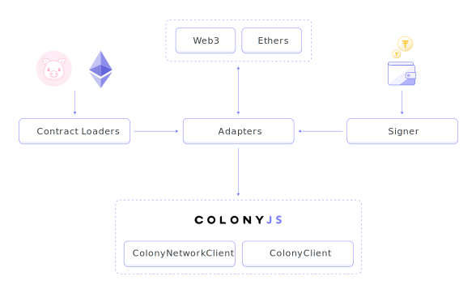

colonyJS is a library to help developers build with Colony.

Using the colonyJS library, you can build applications that query and interact with the Colony Network smart contracts through a simple and standard JavaScript interface.

colonyJS itself is split into a few components to allow for flexibility in development:

* [Loaders](/colonyjs/docs-loaders) provide a simple way to get the address and ABI of a deployed contract, in a certain version, at a particular location (testnet, mainnet, local). Loaders can pull from etherscan.io, or from Colony's own TrufflePig.

* [Adapters](/colonyjs/docs-adapters) represent the colonyJS solution for the many different ways to access the Ethereum blockchain provided by various JavaScript libraries. Adapters provide a wrapper for such libraries that enforces a standard and predictable API for use with Colony's contracts.

* The [Contract Client](/colonyjs/docs-contractclient) is the main event: it aggregates all of the interactions possible with Colony into a standard set of methods that can be used in your (d)app to hook into the Colony Network.

## Jump in

colonyJS is under active development and new features are being added constantly. If you notice a discrepancy in the documentation on this site or a bug in the code, please help us out by [creating an issue](https://github.com/JoinColony/colonyJS/issues)!

That said, everything you need to get started should be listed in the [get started](/colonyjs/docs-get-started/) page. From there, you can see how to use colonyJS inside your javascript application to create a new colony, create a new task in that colony, and take the task through its complete life-cycle.

Because the colonyNetwork contracts are not yet deployed on a public test-net, you'll need to set up a local ganache instance and deploy the colony network contracts to it in order to test your application. You can find more information about this set-up in the [colonyNetwork 'get started' docs](/colonynetwork/docs-get-started/).
